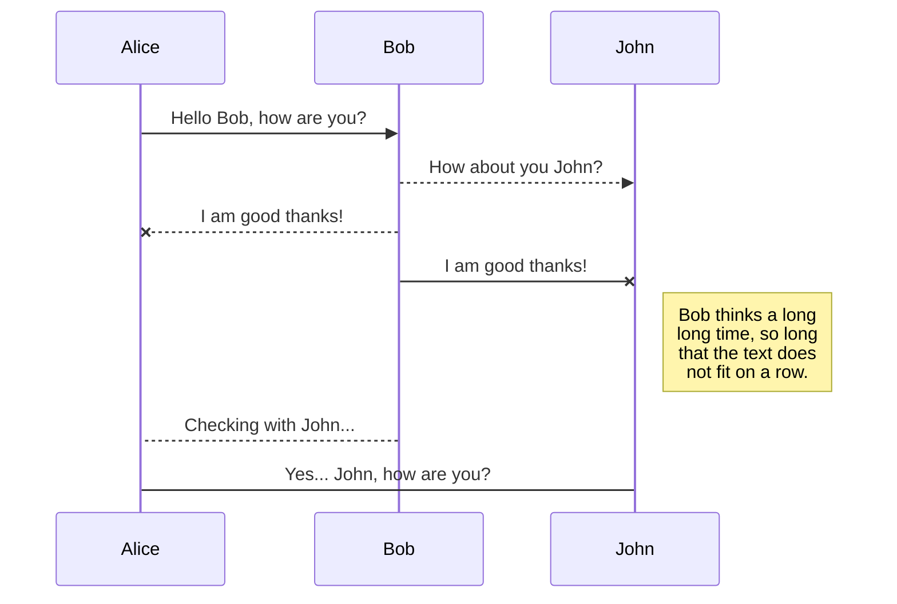
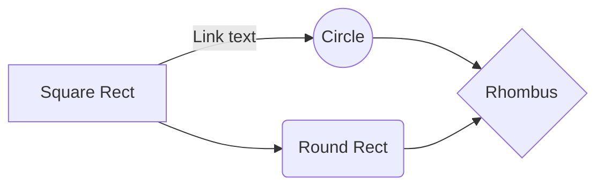

# SNOW (Static aNalysis nOn Webapp)

This repo is the home of static code analysis tooling for repositories that are not covered by Slack's current SCA tooling for webapp, iOS, and Android repos.

## Description

Under the hood, SNOW uses a fabulous open source tool called [semgrep](https://github.com/returntocorp/semgrep).  Semgrep looks for known potentially insecure code patterns like using `exec()` in PHP, or use of insecure hashing algorithms such as MD5 or SHA1.  Static code analysis is an imperfect process that will sometimes flag false positives, and other times will miss insecure code that doesn't exactly match known patterns.  If this scan returns findings that are invalid, the prodsec team is happy to fine-tune any rules that are consistently faulty, or add new rules at any time, so please let us know if you have ideas by pinging #triage-prodsec.

### Dependencies

* Make sure you have the most recent verison of Docker installed on your machine if you would like to run this program locally.

### Executing program

* Clone this repository to your local machine
* Run semgrep locally by modifying the config.cfg, 'run_local_semgrep' to your desired workspace. 
* Semgrep will run against any language in the config file with the syntax <language-xxxx>. The language directory is determined by 'language' variable. 

```
./run_semgrep.py
```

After running the semgrep script, you should receive an output of JSON to your terminal with a list of rule violations similar to this:

```
{"results": [{"check_id": "languages.php.r2c-rules.file-inclusion", "path": "repositories/rss-parser/test/ParserServiceTest.php", "start": {"line": 4, "col": 1}, "end": {"line": 4, "col": 55}, "extra": {"message": "Non-constant file inclusion. This can lead to LFI or RFI if user\ninput reaches this statement.\n", "metavars": {"$FUNC": {"start": {"line": 4, "col": 1, "offset": 32}, "end": {"line": 4, "col": 8, "offset": 39}, "abstract_content": "require", "unique_id": {"type": "AST", "md5sum": "f56ba866525552f1838d37fb00534a01"}}}, "metadata": {"references": ["https://www.php.net/manual/en/function.include.php", "https://github.com/FloeDesignTechnologies/phpcs-security-audit/blob/master/Security/Sniffs/BadFunctions/EasyRFISniff.php", "https://en.wikipedia.org/wiki/File_inclusion_vulnerability#Types_of_Inclusion"]}, "severity": "ERROR", "is_ignored": false, "lines": "require dirname(__FILE__).'/../src/ParserService.php';"}}], "errors": []}
```

## Production

Right now SNOW runs daily scans in Jenkins and sends alerts about failing tests to #alerts-snow.  The prodsec team is in the process of fine tuning how and when scans will run, and how to resolve any alerts that come up.  For now failing tests should be non-blocking, but this may change in the future - more details to come on this subject.

Current links to the daily scans:

* https://jenkins.tinyspeck.com/job/security-semgrep-prodsec
* https://jenkins.tinyspeck.com/job/security-semgrep-prodsec-test/


## Help and Feedback

The ProdSec team wants Slack's static analysis tooling to help, not hinder, developers with writing secure code.  If you have suggestions for improving the process of receiving and addressing SNOW findings, please feel free to reach out to us in #triage-prodsec or #proj-static-analysis-non-webapp.




And this will produce a flow chart:


